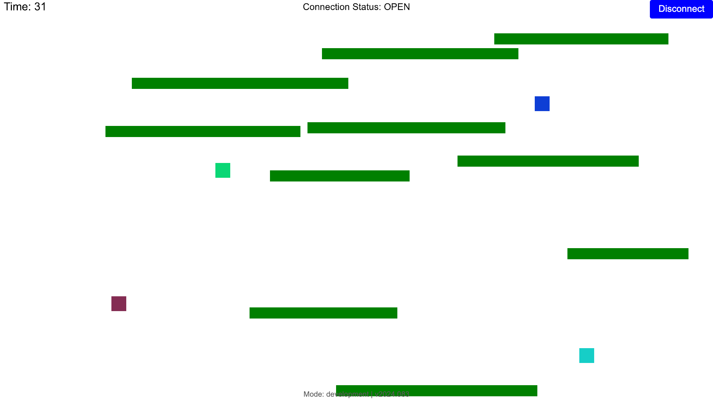

# Websocket Game 

Multiplayer platformer game where players compete to stay airborne as long as possible by jumping between falling platforms. [Play here](https://1aggarcia.github.io/websocket-game/).



I'm building this mainly to get experience with real-time WebSocket servers. The server runs with [Spring Boot](https://spring.io/) for Java using [Maven](https://maven.apache.org/what-is-maven.html) as the build tool. The frontend is built in jQuery (just for the memes). Previously the server was written in TypeScript, I rewrote it in Java to get a refresher of the language.

## Setup & Build

Requires [Node v20](https://nodejs.org/en) (verify installation with `node -v`) and the [Java Developement Kit](https://www.oracle.com/java/technologies/downloads/) of at least version 17.

Developed with [pnpm](https://pnpm.io/) but should work fine with npm, which comes with Node.

### Server:

 It is easiest to run the project from your IDE, but it can be run from the command line:

`cd server`

*(For windows, use a backslash `\` instead of a forward slash `/` for the below commands)*
- Run: `./mvnw clean install && java -jar target/game-0.0.1-SNAPSHOT.jar`
- Build: `./mvnw package`
- Test: `./mvnw test`
- Lint `./mvnw checkstyle:check`

### Frontend
`cd client`

- Run: `npm run dev`
- Build: `npm run build`
- Lint: `npm run lint`

The frontend looks for a server running on `localhost` by default. To specify a different server, create a `.env` file inside the `client` folder and set the `VITE_SERVER_ENDPOINT` enviornment variable to the desired server host.

## Design

### Client
The client is a simple I/O device. It is only responsible for sending controls to the server when the player presses a control, and drawing the game on an HTML canvas when the server sends a ping. It performs no game logic.

### Server
The server holds the game state in memory and manages multiple client sessions. The server receives client events and updates the game state accordingly. On a fixed interval, the server advances the game by one tick and broadcasts the game state to all clients.

#### Events
Events are messages sent between clients and servers. They are encoded as binary using [Protocol Buffers](https://protobuf.dev/), which although introduce more boilerplate than JSON (the first encoding I used), are between 60-90% smaller than the JSON equivalent for this use case.

The server processes events with pure functions, using the following abstraction:
```
process(event, gameState) -> { gameUpdate, reply }
```
Where `gameUpdate` is a data type describing how to modify the game state, and `reply` is an optional message to send back to the client. With this model, the result is determined exclusively by the inputs and the game logic is decoupled from network I/O. Side effects are performed outside the `process` function and are limited to sending replies and applying `gameUpdate`s (simple puts, gets, deletes).

The `process` function has various implementations depending on the event type such as `JoinEvent` or `ControlChangeEvent`.

#### Ticks
The game loop runs on a seperate thread and is more tightly coupled with the game store and the network. Presently there is a function `advanceToNextTick(gameState) -> { nextPlatformState, nextTickCount }`, which is impure since it modifies the player state directly, although it is deterministic and is simple to test.