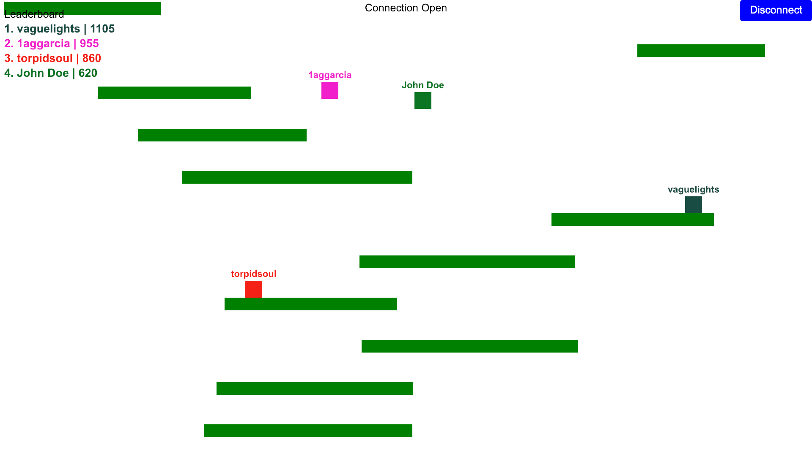

# Websocket Game 

Multiplayer platformer game where players compete to stay airborne as long as possible by jumping between falling platforms. [Play here](https://1aggarcia.github.io/websocket-game/).

I'm building this mainly to get experience with real-time WebSocket servers. The server runs with [Spring Boot](https://spring.io/) for Java using [Maven](https://maven.apache.org/what-is-maven.html) as the build tool. The frontend is built in jQuery (just for the memes). Previously the server was written in TypeScript, I rewrote it in Java to get a refresher of the language.

## Setup & Build

Requires [Node v20](https://nodejs.org/en) (verify installation with `node -v`) and the [Java Developement Kit](https://www.oracle.com/java/technologies/downloads/) of at least version 17.

Developed with [pnpm](https://pnpm.io/) but should work fine with npm, which comes with Node.

### Server:

You should be able to run the server in your IDE, but this is possible from the command line:

`cd java-server`

- Run: `./mvnw clean install && java -jar target/game-0.0.1-SNAPSHOT.jar`
- Build: `./mvnw package`
- Test: `./mvnw test`
- Lint `./mvnw checkstyle:check`

### Frontend
`cd client`

- Run: `npm run dev`
- Build: `npm run build`

The frontend looks for a server running on `localhost` by default. To specify a different server, create a `.env` file inside the `client` folder and set the `VITE_SERVER_ENDPOINT` enviornment variable to the desired server host.
